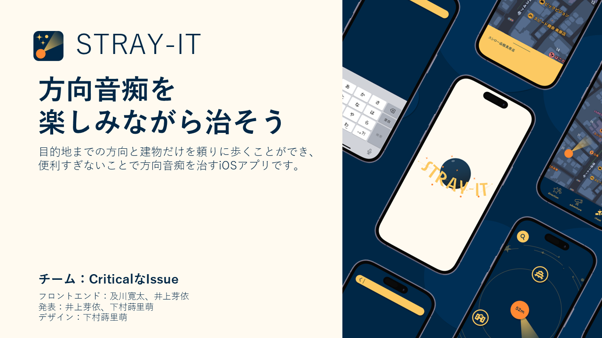

# P2HACKS2022 アピールシート 

プロダクト名  
... STRAY-IT

コンセプト  
...  方向音痴を治したい人向けのiOSアプリ。未来の便利な地図アプリとは異なり、便利すぎないことで、楽しみながら方向音痴を治すことができる。

対象ユーザ  
...  便利なスマホ地図アプリを活用しているものの、いざというときに道を覚えられなくて困っているような人。

利用の流れ  
...  ディレクションモードで、目的地と周りの建物の種類だけを頼りに歩く。アドベンチャーモードでは、ゲーム性のある画面で楽しみながら歩ける。完全に迷ったときには、チートモードで目的地にたどり着くことで、達成感を得られる。

推しポイント  
...  ライトモードとダークモードがある。STRAY-ITというアプリ名は、Stray(迷子)×Straight(まっすぐ)×ITという意味。

スクリーンショット(任意)  
    

## 開発体制  

役割分担  
...  フロントエンド：及川寛太、井上芽依　発表：井上芽依、下村蒔里萌　デザイン：下村蒔里萌

開発における工夫した点  
...  楽しんでアプリを使用できるよう、デザインにこだわった。

## 開発技術 

利用したプログラミング言語  
...  Swift

利用したフレームワーク・ライブラリ  
...  SwiftUI, MapKit, CoreLocation, 

その他開発に使用したツール・サービス
...  Figma, Xcode, Adobe Illustrator, GitHub
